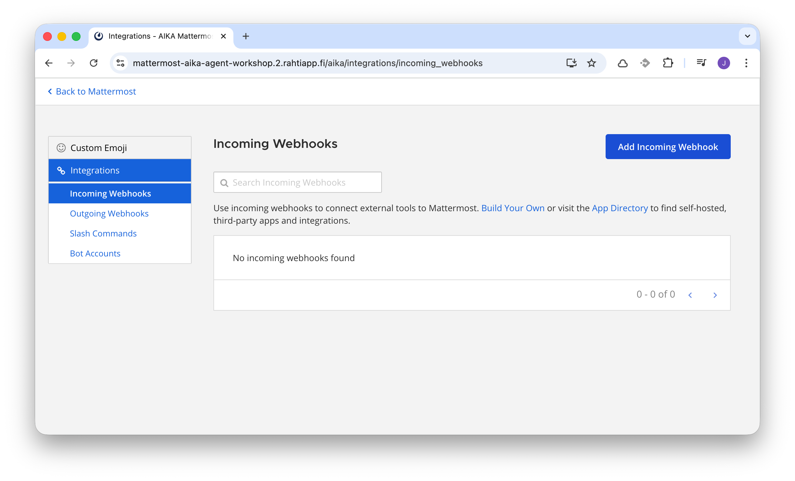
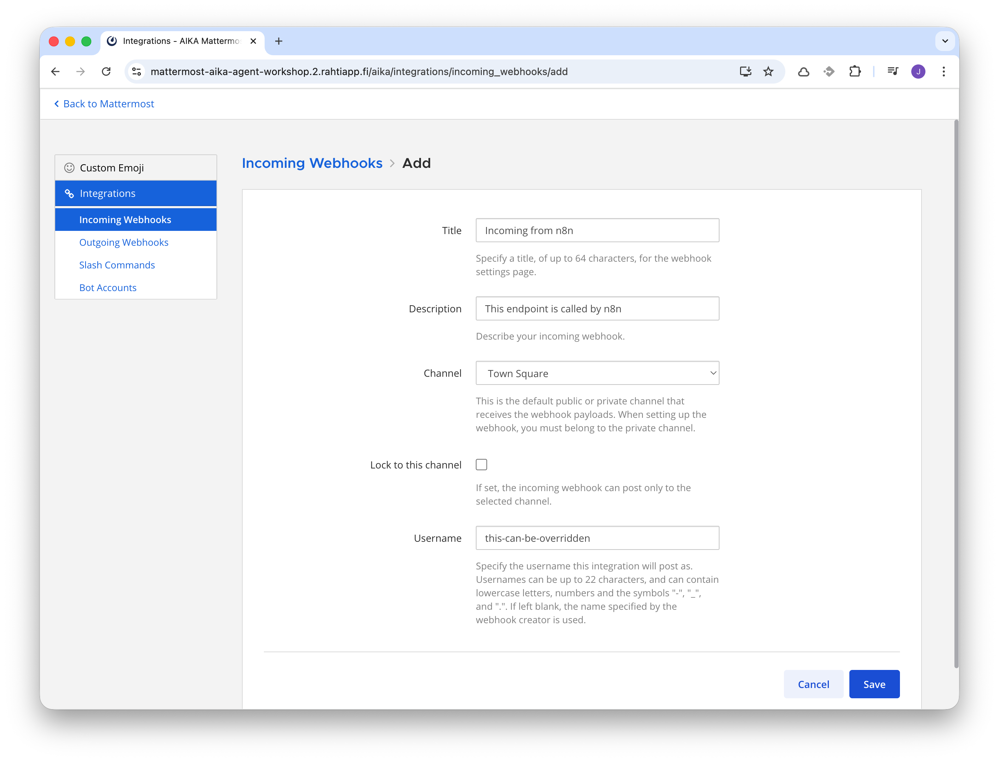
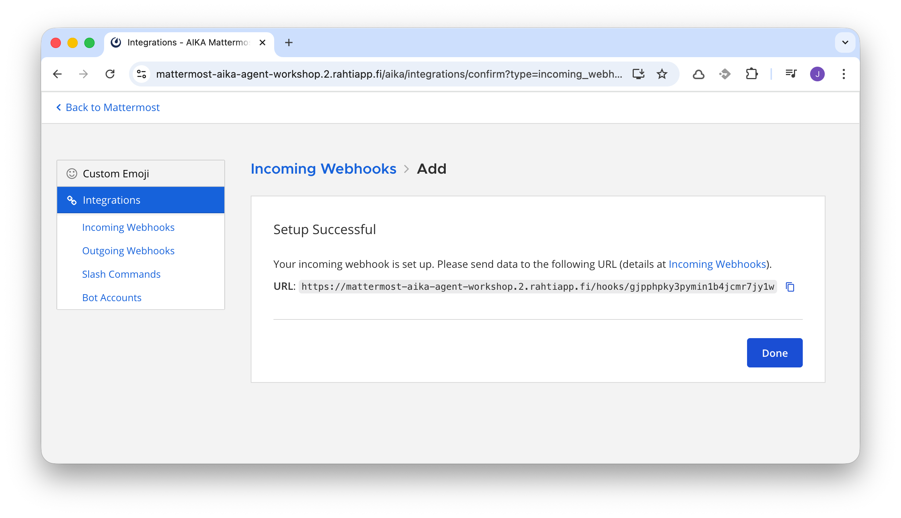
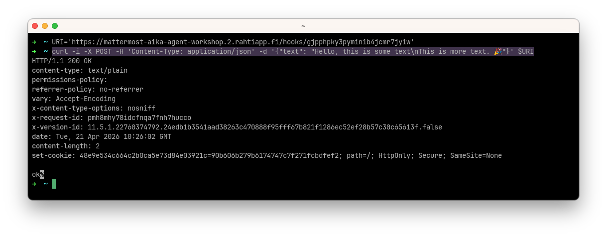
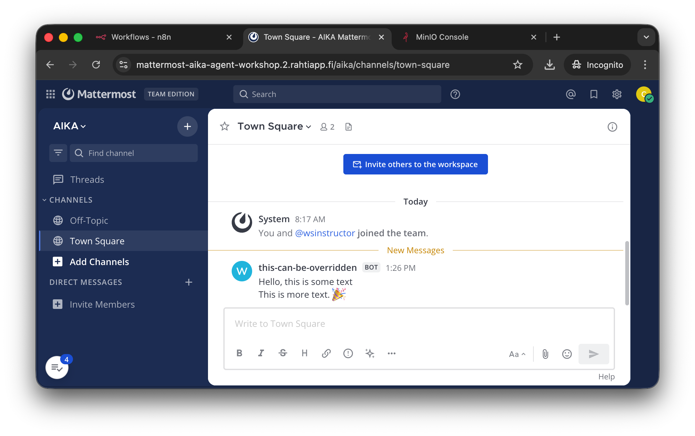

# Manual Steps

This documentation includes a set of steps that do not have an automated CLI command, and must be performed manually in the UI. They are formatted as a list of QA-like problems and solutions.

## Mattermost In/Outgoing Webhooks

Typical users cannot create incoming or outgoing webhooks in Mattermost. Instead of enabling this for all, create them and share the information to the group. These steps are not rocket science, but I've included images since this information might be informative for the participants as well.


/// caption
Webhooks are added in the Integrations > Incoming Webhooks section of the Mattermost System Console.
///


/// caption
There are not too many settings in the menu. Choose title, description, channel, and username that it will be posted as. The username can also be later on changed in the workflow using the `username` field in the JSON body of the webhook.
///


/// caption
The URL shown here should be kept secret. Sending anything to that URI will post a message to the Mattermost channel.
///

Sending an HTTP POST request to that URL with a JSON body containing `text` field will post the content of that field as a message to the Mattermost channel. For example:


/// caption
A command line tool `curl` has been used to send a POST request to the URL seen in the screenshot above.
///


/// caption
The command appears in the Mattermost Town Square channel as a message. Note that anyone could've sent this message.
///

You can read more about this feature at Mattermost's [Incoming Webhooks documentation](https://developers.mattermost.com/integrate/webhooks/incoming/).

## Mattermost incoming custom username forbidden

To change the incoming username, the field is `username` instead of `user_name`, AND the following setting must be enabled from the [Mattermost System Console > Integrations > Integration Management](https://mattermost-aika-agent-workshop.2.rahtiapp.fi/admin_console/integrations/integration_management):

> Enable integrations to override usernames: True

!!! tip "Fixed?"

    This has potentially already been fixed with workshop.yaml file environment variable:

    ```
        - name: MM_SERVICESETTINGS_ENABLEPOSTUSERNAMEOVERRIDE
          value: "true"
    ```

    This requires verification in a fresh deployment where the settings has not been changed manually.
