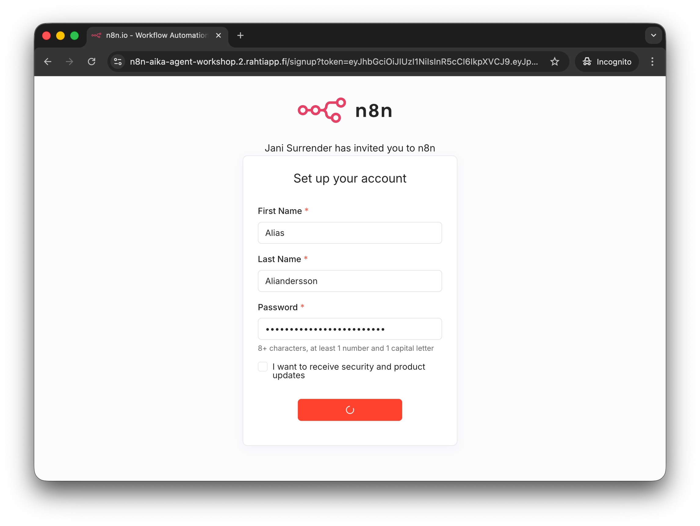
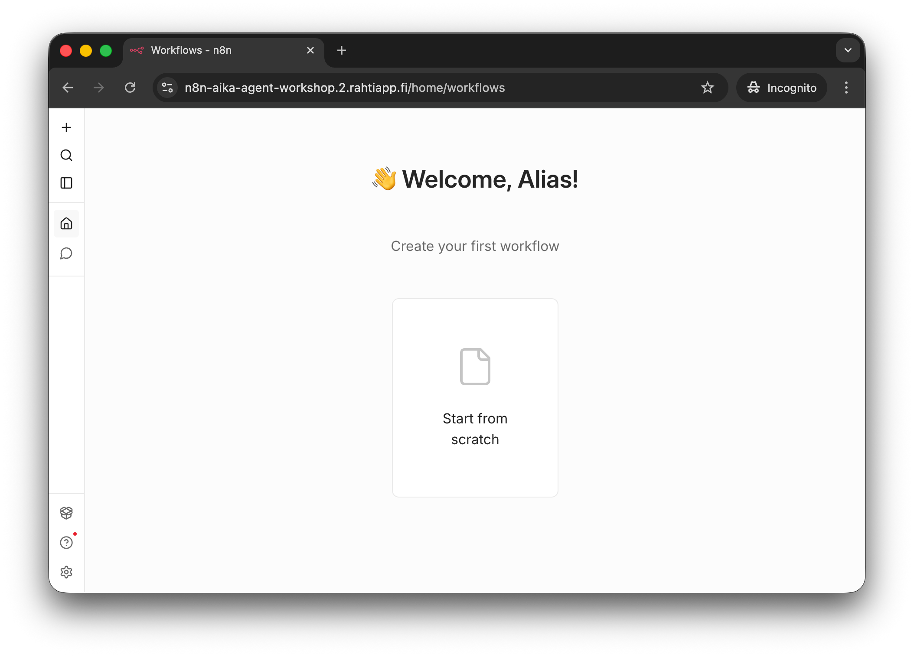

# Phase 1: Create Credentials

## Goal

The goal of this phase is simple: you can sign in to n8n with your workshop email and a memorable password that you chose yourself.

## Guided steps

### Step 1: Open the invitation link

Open the `n8n_invitation_url` you received from the instructor. It will take you to the n8n sign-up page.

/// caption
Create your account using the workshop email and a memorable password. You can choose any first name and surname. Avoid using real personal information if you prefer not to.
///

!!! warning "Do not forget your password"

    Do NOT forget your password. We will not have time for password resets in this workshop. Choose a password that you can remmeber for the next 45 minutes.

### Step 2: Finish sign-up and enter n8n

After the form is accepted, n8n may show a few onboarding screens. It is fine to skip anything that is not needed for the workshop and continue to the site.

/// caption
This is the n8n welcome page after signing up and continuing past any optional onboarding screens.
///

If you accidentally close the browser tab, do not worry. Simply navigate back to: [n8n-aika-agent-workshop.2.rahtiapp.fi](https://n8n-aika-agent-workshop.2.rahtiapp.fi) and sign in with the email and password you just created.
