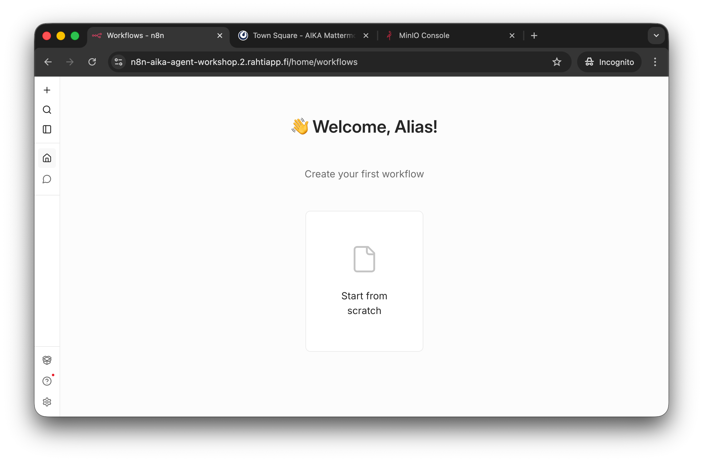
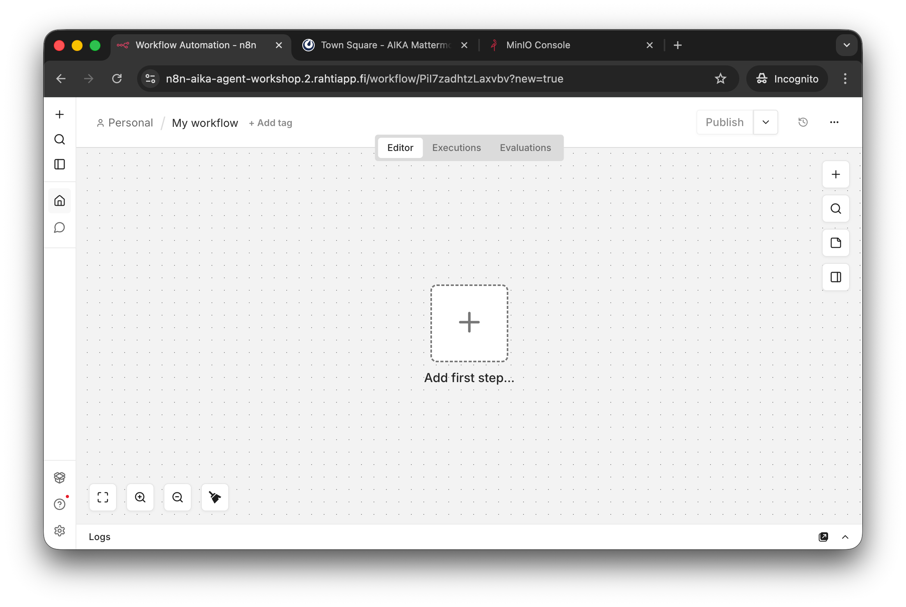
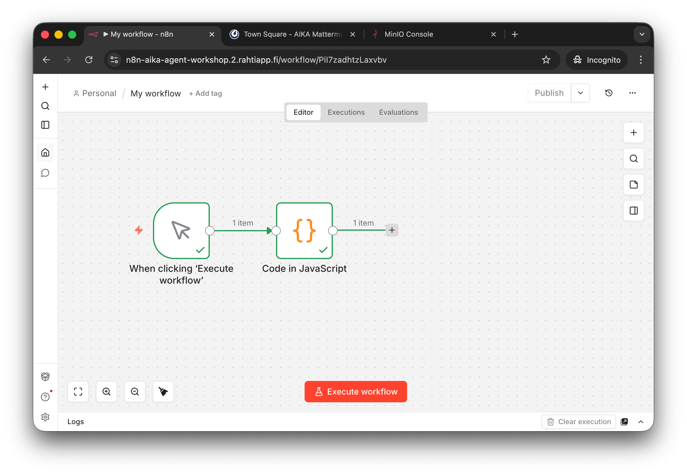
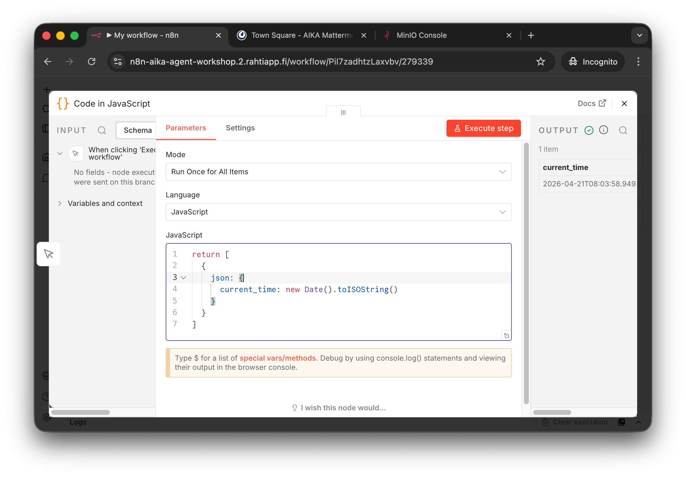
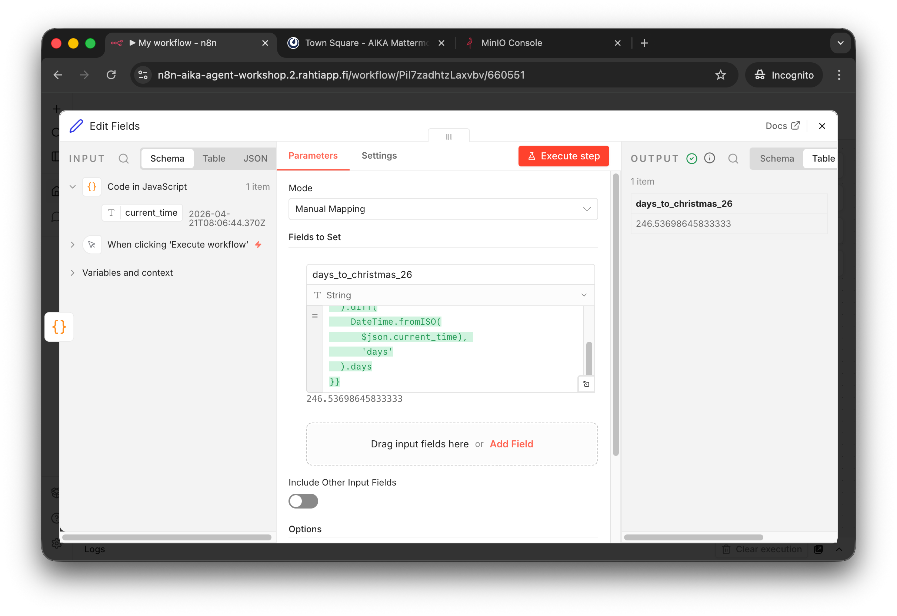

# Phase 2: First Workflow Ever

## Goal

The goal of this phase is to get comfortable with the n8n editor by importing a very small workflow, running it, and inspecting what each node does.

!!! info "Workflow JSON"

    Create a new empty workflow in n8n and paste the JSON below into the editor.

    ```json
    {
      "name": "First Workflow Ever",
      "nodes": [
        {
          "parameters": {},
          "type": "n8n-nodes-base.manualTrigger",
          "typeVersion": 1,
          "position": [
            0,
            0
          ],
          "id": "1c9e5c65-8d25-4ccb-9047-b7d4e18c64d7",
          "name": "When clicking Execute workflow"
        },
        {
          "parameters": {
            "jsCode": "return [\n  {\n    json: {\n      current_time: new Date().toISOString()\n    }\n  }\n]"
          },
          "type": "n8n-nodes-base.code",
          "typeVersion": 2,
          "position": [
            208,
            0
          ],
          "id": "279339b0-b7ae-419f-9cb8-b11d89ddb211",
          "name": "Code in JavaScript"
        },
        {
          "parameters": {
            "assignments": {
              "assignments": [
                {
                  "id": "8fdecf8a-f361-4b38-b5ca-727567615629",
                  "name": "days_to_christmas_26",
                  "value": "={{ \n  DateTime.fromISO(\n    '2026-12-24'\n  ).diff(\n    DateTime.fromISO(\n      $json.current_time), \n      'days'\n  ).days\n}}",
                  "type": "string"
                }
              ]
            },
            "options": {}
          },
          "type": "n8n-nodes-base.set",
          "typeVersion": 3.4,
          "position": [
            416,
            0
          ],
          "id": "6605510b-e9c2-4a41-b32c-bce8694f5f43",
          "name": "Edit Fields"
        }
      ],
      "pinData": {},
      "connections": {
        "When clicking Execute workflow": {
          "main": [
            [
              {
                "node": "Code in JavaScript",
                "type": "main",
                "index": 0
              }
            ]
          ]
        },
        "Code in JavaScript": {
          "main": [
            [
              {
                "node": "Edit Fields",
                "type": "main",
                "index": 0
              }
            ]
          ]
        }
      },
      "active": false,
      "settings": {
        "executionOrder": "v1",
        "binaryMode": "separate"
      },
      "tags": []
    }
    ```

    This is the same sharing format that n8n uses on its workflow website. Importing JSON is a normal way to learn, reuse, and inspect workflows.

## Step 1: Create an empty workflow

From the n8n overview page, create a new workflow.


/// caption
Create a new workflow from the overview page.
///

An empty workflow is enough. You do not need to add any nodes manually in this mini version.


/// caption
The empty editor is the place where you will paste the JSON.
///

## Step 2: Paste the JSON

Copy the JSON from the admonition above and paste it into the empty workflow editor.

After pasting, you should see a workflow with three nodes:

- a Manual Trigger
- a Code node
- an Edit Fields node


/// caption
The imported workflow is very small on purpose. The point is to inspect the flow from one node to the next.
///

## Step 3: Execute the workflow

Press `Execute Workflow`.

The workflow does two things:

1. it creates the current time in ISO format
2. it computes the difference in days to Christmas Eve 2026

If everything works, each node should show a successful execution state.

## Step 4: Inspect the nodes

Open the `Code in JavaScript` node and inspect the code that creates `current_time`.


/// caption
The Code node returns one JSON object with a single field named `current_time`.
///

Then inspect the `Edit Fields` node. It uses an n8n expression to create a new field called `days_to_christmas_26`.


/// caption
After execution, the last node shows the computed number of days until Christmas Eve 2026.
///

## Step 5: Understand what you imported

This workflow is intentionally simple, but it demonstrates three important ideas:

- JSONs are everywhere. JSON's are everything.
- workflows can start with a manual trigger
- one node can generate structured JSON data for the next node
- another node can transform that data with expressions

## Success check

You have completed this phase when:

- you successfully pasted the JSON into a new workflow
- the workflow executed without errors
- you inspected the output of the `Code in JavaScript` node
- you inspected the output of the `Edit Fields` node

Continue to Phase 3 when you are ready to import and repair your first AI Agent workflow.