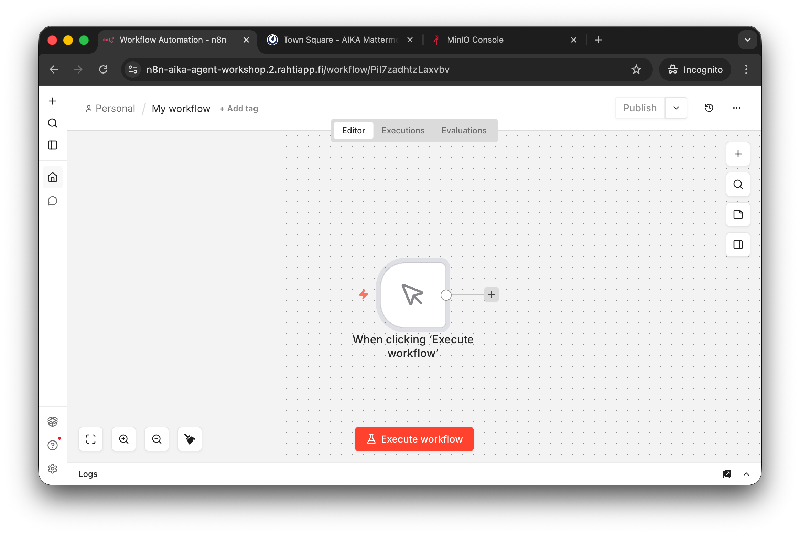
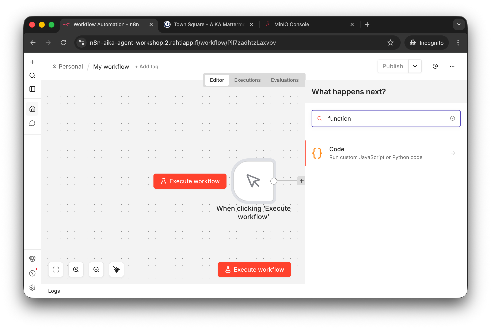
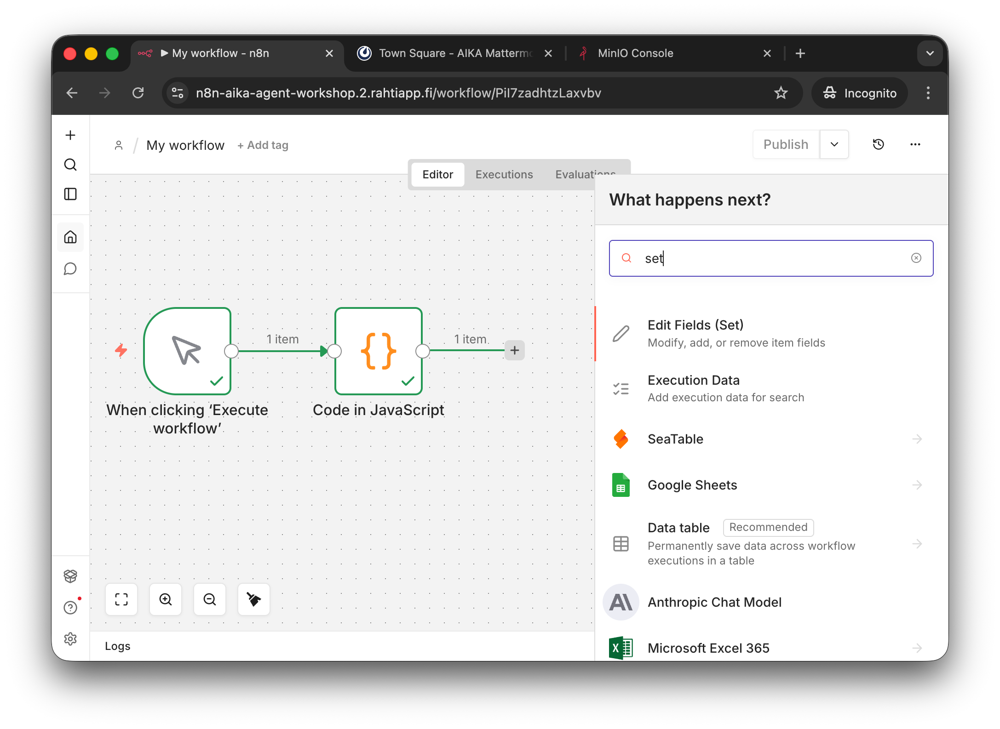
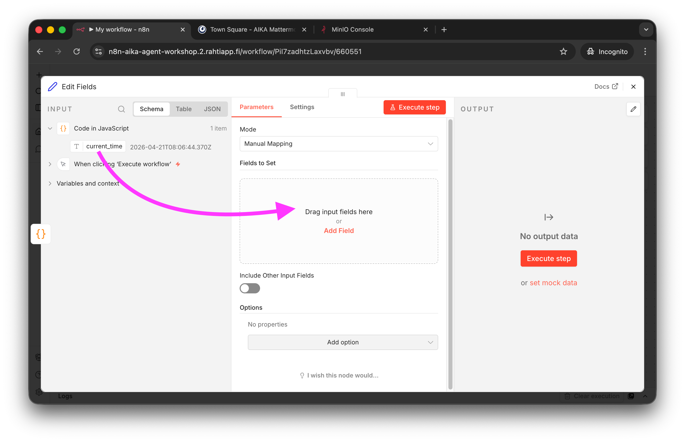
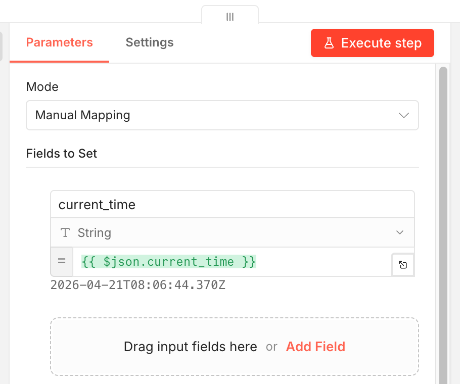
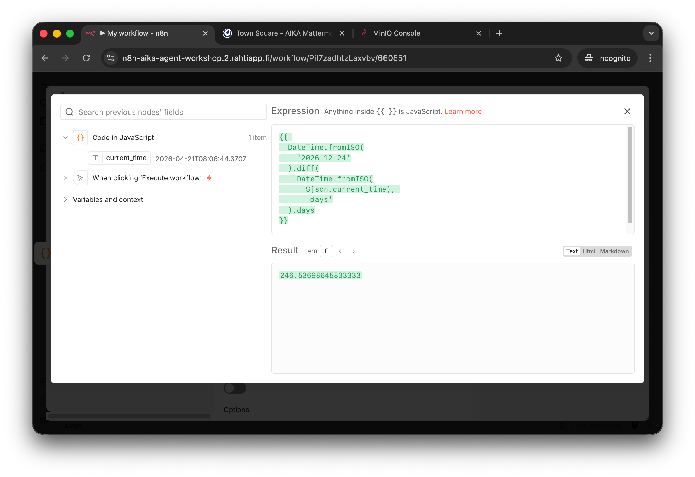
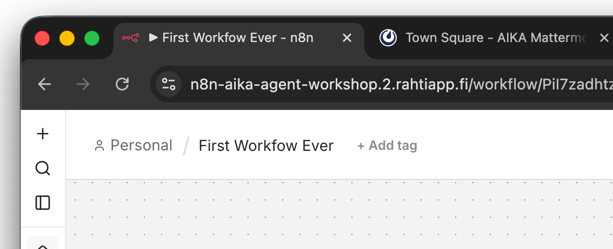
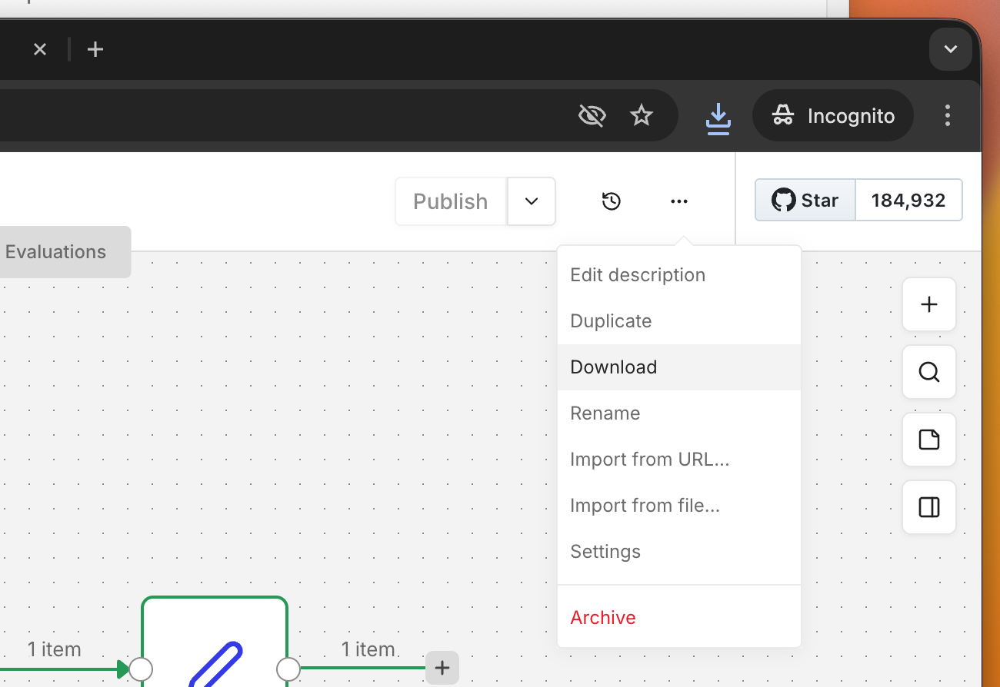

# Phase 2: First Workflow Ever

## Goal

This Phase is all about getting familiar with the n8n user interface and creating your first workflow. To get started, we will do a **very simple** workfloat that has a manual trigger and a single node that returns the current date and time. This is a common "Hello World" type of workflow for n8n beginners. Nothing is AI yet: this is a deterministic workflow. The next Phase will be about creating your first AI Agent, but before that, let's get comfortable with the n8n UI and workflow creation process.

## Step 1: Create the workflow


/// caption
The n8n editor interface. The quick tutorial for this is given during the instructor-led session. The platform is quite intuitive, so you might simply guess how to get stuff done. Start by pressing the `Start from scratch` button or the `+` icon to create a new workflow.
///

The newly created workflow is empty, and thus, the UI is guiding you to add the first trigger node. Click the guide text, `Add first step...`, or `+` icon to add a trigger node.


/// caption
Empty workflow.
///

## Step 2: Add a manual trigger


/// caption
Manual trigger added. Note that there are multiple ways to trigger a workflow. Manual is simple, but for automated workflows, you would use either schedule or some even-based trigger (e.g. a new calendar event being added, a new ZenDesk ticket created, etc.).
///

## Step 3: Add a function node

To get the time of the day, we can use a simple JavaScript function. Add a new node and select `Code` from the list of nodes.


/// caption
You can use the Search to find the node you are looking for. For example, in this case, I didn't remember it was called `Code`, but found it using a search for `function`.
///

Then, choose `Code in Javascript`. The image running n8n does not have Python, so sadly, you cannot use Python code here. Write the following code into the node:

``` javascript
return [
  {
    json: {
      current_time: new Date().toISOString()
    }
  }
]
```


/// caption
The code has been copy-pasted to the JavaScript code editor and the `Execute Step` has been pressed.
///

Note that the output contains 1 item with a key `current_time` and the value is the current time in ISO format. If there is no output, press the `Execute Step` button. This output can then be used in another node. Let's test that.


/// caption
You can close the Code Node editor by pressing the `X` in the top right corner. You should now see your workflow consisting of the Manual Trigger and the Code node. You can press the `Execute Workflow` button to run the workflow. If all goes well, you should see the green checkbox indicators. Also, you can check the `Logs` pane – botton of the screen – and the `Executions` tab to see the details of each execution.
///

### Step 3: Accessing JSON output

Note that the outputted data was in the format of:

``` json
[
  {
    "json": {
      "current_time": "2026-01-01T12:00:00.000Z"
    }
  }
]
```

In n8n, the data is always in this format of an array of items, where each item has a `json` key. This allows for multiple items to be processed in a workflow. We can access this data in the concurrent nodes by using n8n expressions. Writing expresions takes some practice. You can find the documentation for the syntax at [Expression Reference](https://docs.n8n.io/data/expression-reference/). 

!!! tip

    Language models are handy when you need to write expression. You can ask for example, that:

    > "I have timestamp in a key `current_time` in the input data. How would I compute the difference in days to Christmas Eve of 2026 (2026-12-24)? Write only the n8n expression without any explanations. Documentation is at: https://docs.n8n.io/data/expression-reference/datetime/#datetimeday"

    The output of GPT-5.3 Quick Response is...

    ``` text
    {{ DateTime.fromISO('2026-12-24T00:00:00').diff(DateTime.fromISO($json.current_time), 'days').days }}
    ```

    This happens to be a correct solution!

Let's compute the difference to a hard-coded Christmas 2026.


/// caption
Add a new concecutive node and select `Edit Fields (Set)` from the list.
///

The Edit Fields (Set) node allows you to set new fields based on the input data. It is a very common node for data transformation. You can, for example, set a new field `days_to_christmas_26` with the value of the expression we just wrote. Let's do that.


/// caption
To get an input field into the expression, you can simply drag the field into the `Field to Set` location, as guided by the UI. Do try this, even though we will edit the expression.
///


/// caption
You can see that the new field is called `current_time` – which would override the original field. The value is `{{ $json.current_time }}`. It simply refers to the value of the `current_time` field in the input data.
///

Before proceeding to the next step, you might want to press the tiny button on the right side of the expression field to open a larger expression editor. This is usually more comfortable for writing complex expressions. Now, you can simply paste the JavaScript expression we got from GPT-5.3 Quick Response:


/// caption
The expression has been pasted into the larger editor. Note that I have also formatted it for readability reasons. Formatting is easy with ++tab++ button to indent and ++shift++++tab++ to unindent. You can see the output in the `Result` box.
///


/// caption
After closing the expression editor, you can run the workflow again and see the new field `days_to_christmas_26` with the value of... well, the actual days till Christmas Even 2026.
///

### Step 4: Name the Workflow

You can rename the Workflow in the top-left corner by clicking the default title. I've named in to First Workflow Ever, but you can be more creative if you like.


/// caption
The Workflow has a new name now.
///

### Step 5: Download the workflow JSON

It is good to know that you can Download (Export) and Import workflows as JSON files. This is useful for sharing workflows, creating backups, or moving workflows between different n8n instances.


/// caption
The Download (and Import) buttons are located in the top-right corner of the workflow editor, accessible by clicking the `...` menu icon.
///

You can also find thousands of workflow examples in the [n8n: Workflows](https://n8n.io/workflows/) page. These are shared using the exact same method: someone has exported the workflow as a JSON file and shared it on the community page. We will use this feature in the following Phase.

??? tip "What does the file contain? Click this admonition to find out..."

    The downloaded file contents are below:

    ```json
    {
        "name": "First Workfow Ever",
        "nodes": [
            {
            "parameters": {},
            "type": "n8n-nodes-base.manualTrigger",
            "typeVersion": 1,
            "position": [
                0,
                0
            ],
            "id": "1c9e5c65-8d25-4ccb-9047-b7d4e18c64d7",
            "name": "When clicking ‘Execute workflow’"
            },
            {
            "parameters": {
                "jsCode": "return [\n  {\n    json: {\n      current_time: new Date().toISOString()\n    }\n  }\n]"
            },
            "type": "n8n-nodes-base.code",
            "typeVersion": 2,
            "position": [
                208,
                0
            ],
            "id": "279339b0-b7ae-419f-9cb8-b11d89ddb211",
            "name": "Code in JavaScript"
            },
            {
            "parameters": {
                "assignments": {
                "assignments": [
                    {
                    "id": "8fdecf8a-f361-4b38-b5ca-727567615629",
                    "name": "days_to_christmas_26",
                    "value": "={{ \n  DateTime.fromISO(\n    '2026-12-24'\n  ).diff(\n    DateTime.fromISO(\n      $json.current_time), \n      'days'\n  ).days\n}}",
                    "type": "string"
                    }
                ]
                },
                "options": {}
            },
            "type": "n8n-nodes-base.set",
            "typeVersion": 3.4,
            "position": [
                416,
                0
            ],
            "id": "6605510b-e9c2-4a41-b32c-bce8694f5f43",
            "name": "Edit Fields"
            }
        ],
        "pinData": {},
        "connections": {
            "When clicking ‘Execute workflow’": {
            "main": [
                [
                {
                    "node": "Code in JavaScript",
                    "type": "main",
                    "index": 0
                }
                ]
            ]
            },
            "Code in JavaScript": {
            "main": [
                [
                {
                    "node": "Edit Fields",
                    "type": "main",
                    "index": 0
                }
                ]
            ]
            }
        },
        "active": false,
        "settings": {
            "executionOrder": "v1",
            "binaryMode": "separate"
        },
        "versionId": "a551205a-3bc3-4557-a138-47f08c6d9452",
        "meta": {
            "instanceId": "dcbba504dba568007da71e4c9564627df588cf182ff3d477119f46c3bbfbac8e"
        },
        "id": "PiI7zadhtzLaxvbv",
        "tags": []
    }
    ```

## Success check

If you can run the workflow and the last Node shows the days until Christmas Eve 2026, you have successfully completed this Phase! Congratulations on creating or importing your first n8n workflow!

## If you are stuck

If you cannot replicate the steps above, you can download the workflow JSON file and import it into your n8n personal space. The url to the file is [gh:sourander/agentic-workshop-2026/workflow-examples/02-first-workflow-ever.json](https://github.com/sourander/agentic-workshop-2026/blob/main/workflow-examples/02-first-workflow-ever.json).

1. Download the file from GitHub (*Download raw file* button)
2. In n8n, click the `...` menu in the top-right corner of the workflow editor and select `Import from File`.
3. Select the downloaded JSON file and import it.
4. Execute the workflow and check the output.

!!! tip

    Alternatively, you can copy the JSON content from the code block above and simply paste it using ++ctrl++v++ in the n8n Workflow editor.
