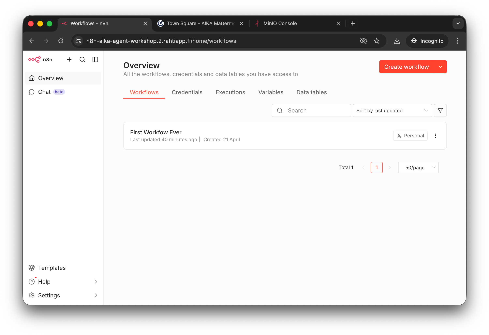
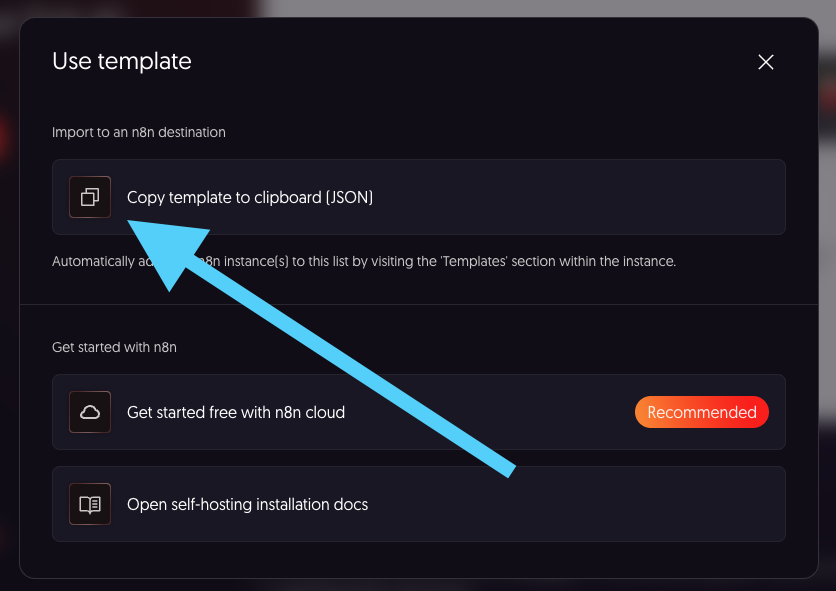
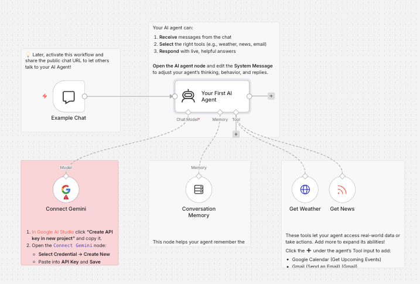
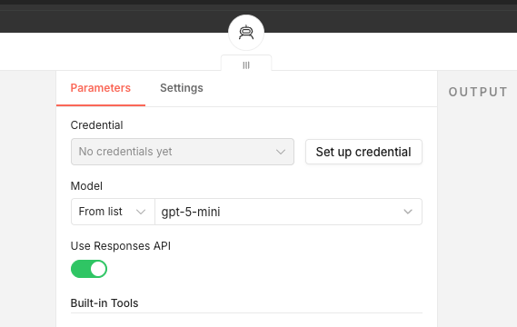
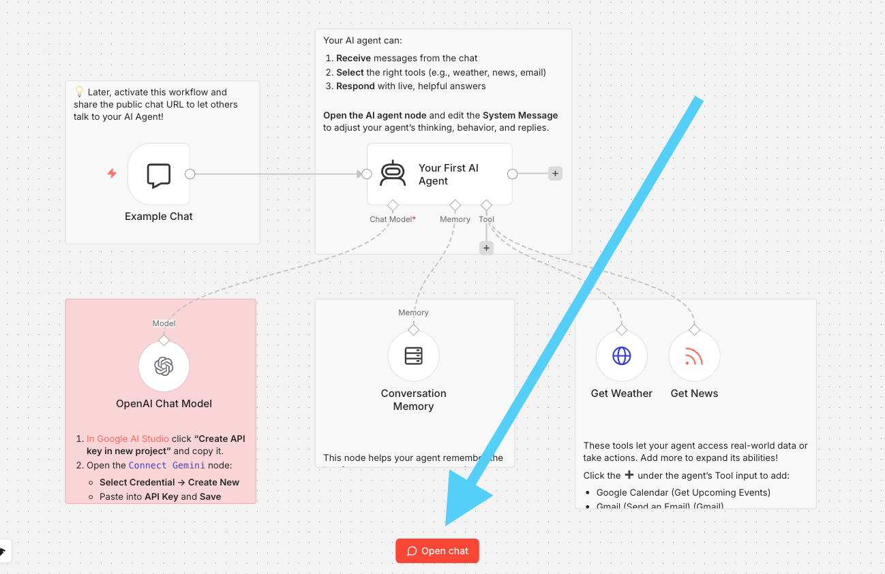
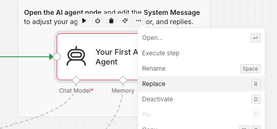
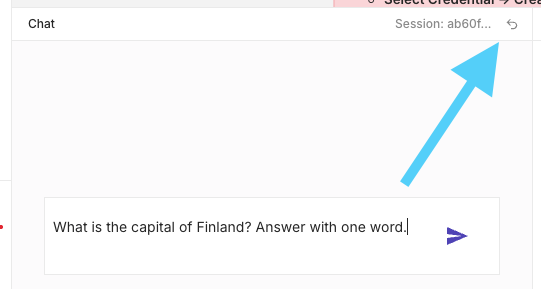

# Phase 3: First AI Agent

## Goal

The goal of this Phase is to create a simple AI Agent workflow in n8n. The workflow will be triggered manually, but it will utilize an OpenAI model to generate a response.

## Step 1: Create the workflow


/// caption
In the front page of n8n, you can see the Overview view, which shows all your workflows. Click the "New Workflow" button to create a new workflow.
///

Click the large red/orange `Create workflow` button in the top right corner of the screen. This will open a new, empty workflow. You can name it if you want, but it is not necessary.

## Step 2: Get a Template Workflow

Instead of starting from scratch, we will use a template. Navigate to [/n8n.io/workflows/](https://n8n.io/workflows/). You should find a template workflow named [Build your first AI agent](https://n8n.io/workflows/6270-build-your-first-ai-agent/). The site will have a large button saying ==Use for free==. Click that. A popup will open.


/// caption
Click the `Copy template ...` button. It will copy the workflow template as a JSON to your clipboard.
///

## Step 3: Paste the Workflow

Now, go back to n8n and paste (++ctrl+v++) the JSON into the empty workflow. You should see the workflow being populated. You can delete the post-it looking Sticky Note nodes if you want. In the screenshot below, I have deleted two of them to make the workless slightly less cluttered.



## Step 4: Switch from Gemini to OpenAI

The workflow template uses Gemini, but we will switch it to OpenAI. To do this:

1. Delete the `Connect Gemini` Model Node by pressing the small bin icon on the node.
2. Press the `+` icon on the `Your First AI Agent` node to add a new node after it.
3. Search for `OpenAI` and select the `OpenAI Chat Model` node.

## Step 5: Create the Credential

Now, you need to create a credential. OpenAI is a paid service, so obviously you need some sort of authentication so that billing works. In this workshop, you will use the instructor's shared API token.


/// caption
You can see that the Credential field has a "No credential yet" message. Click the **Set up credential** button.
///

Now, the instructor will not share an actual key with you. What is being done is we use a special proxy for OpenAI API requests in the workshop environment. This proxy adds the shared API token to the request before forwarding it to OpenAI. Thus, you can create a credential with any placeholder value as the token, and it will work.

Thus, you will need to fill in the following values for the credential:

* API Key: you can literally write anything here, e.g. `kissa` or `foobar`.
* Base URL: `http://openai-proxy/v1`

Then, press the Save button.

## Step 6: Test with the Chat

!!! warning

    An error is expected when executing this step. Do not panic. We will fix it in the next step.


/// caption
Now, click the `Open chat` button indicated by the large arrow in the screenshot above. This will open a chat interface where you can send messages to the OpenAI model and receive responses.
///

Open a Chat like instructed in the image caption above. A good tester prompt for any LLM is e.g.

> "What is the capital of Finland? Answer with one word."

## Step 7: Fix the Error

There is an error pop-up in the lower right corner of the screen when you try to use the chat:

> Problem in node ‘Your First AI Agent‘
> 
> This model is not supported in 2.2 version of the Agent node. Please upgrade the Agent node to the latest version.

This is related to how n8n versions nodes inside the workflows. The template workflow is 9 months old (at the time of writing this), and the Agent node has had a few updates since then. To fix this, you need to update the Agent node to the latest version. To do this:

1. Click the `...` icon on the `Your First AI Agent` node.
2. Choose `Replace` from the dropdown menu.
3. Search for `Agent` and select the `AI Agent` node.


/// caption
The `Replace` option is located in the dropdown menu that appears when you click the `...` icon on the node.
///

!!! warning

    You will lose the system message that the old Agent node had. The message in the template is:

    ```
    <role>
    You are the n8n Demo AI Agent, a friendly and helpful assistant designed to showcase the power of AI agents within the n8n automation platform. Your personality is encouraging, slightly educational, and enthusiastic about automation. Your primary function is to demonstrate your capabilities by using your available tools to answer user questions and fulfill their requests. You are conversational.
    </role>

    <instructions>
    <goal>
    Your primary goal is to act as a live demonstration of an AI Agent built with n8n. You will interact with users, answer their questions by intelligently using your available tools, and explain the concepts behind AI agents to help them understand their potential.
    </goal>

    <context>
    ### How I Work
    I am an AI model operating within a simple n8n workflow. This workflow gives me two key things:
    1.  **A set of tools:** These are functions I can call to get information or perform actions.
    2.  **Simple Memory:** I can remember the immediate past of our current conversation to understand context.

    ### My Purpose
    My main purpose is to be a showcase. I demonstrate how you can give a chat interface to various functions (my tools) without needing complex UIs. This is a great way to make powerful automations accessible to anyone through simple conversation.

    ### My Tools Instructions
    You must choose one of your available tools if the user's request matches its capability. You cannot perform these actions yourself; you must call the tool.

    ### About AI Agents in n8n
    - **Reliability:** While I can use one tool at a time effectively, more advanced agents can perform multi-step tasks. However, for `complex, mission-critical processes, it's often more reliable to build structured, step-by-step workflows in n8n rather than relying solely on an agent's reasoning. Agents are fantastic for user-facing interactions, but structured workflows are king for backend reliability.
    - **Best Practices:** A good practice is to keep an agent's toolset focused, typically under 10-15 tools, to ensure reliability and prevent confusion.

    ### Current Date & Time
    {{ $now }}
    </context>

    <output_format>
    - Respond in a friendly, conversational, and helpful tone.
    - When a user's request requires a tool, first select the appropriate tool. Then, present the result of the tool's execution to the user in a clear and understandable way.
    - Be proactive. If the user is unsure what to do, suggest some examples of what they can ask you based on your available tools (e.g., Talk about your tools and what you know about yourself).
    </output_format>
    </instructions>

    
    ```

    If you have never seen anything like this, this is called a "system prompt". It is a message that is given to the AI Agent to instruct it how to behave. The LLM will predict what word comes next, and then repeat, and then repeat, and then repeat... until it ends up generating a token `EOS` (End of Sequence). Then it stops.

## Step 8: Test Again


/// caption
You can reset the chat context by clicking the **Reset chat session** button indicated by the large arrow in the screenshot above.
///

1. Reset the chat session to save precious tokens.
2. Try the same prompt again (e.g. "What is the capital of Finland? Answer with one word.")
3. The response should be printed with no errors.

## Step 9: Inspect the Workflow

Now, it would be a good idea to inspect the Nodes that were run, and Nodes that were not run. The nodes that were run are:

- [x] Example Chat
- [x] AI Agent
- [x] OpenAI Chat Model
- [x] Conversation Memory

The nodes that were not run are:

- [ ] Get Weather
- [ ] Get News

Inspect all and go through their settings. You will find several interesting things, such as:

* The **Chat** has an public URI like `https://n8n-aika-agent-workshop.2.rahtiapp.fi/webhook/e5616171-e3b5-4c39-81d4-67409f9fa60a/chat`
    * ... but it cannot be accessed before pressing "Publish"
    * It has no authentication what-soever, so anyone could send messages to it if it was published.
    * But you COULD enable Basic Auth or n8n User Auth.
    * There is an Initial message. This is shown to the user and it not the *system prompt*.
* The **AI Agent** lacks the system prompt that the old Agent node had.
    * You can add it by pressing the Add option -> System message. Copy paste it from above.
    * Please add it.
* The **Conversation Memory** node is used to store the conversation history. 
    * It has a context window lenght of 30 previous interactions. This means that the Agent can "remember" the last 30 interactions in the chat. After that, it has no memory of what you have discussed.
    * This is an in-memory, simple solution. For more robust use case, you would use e.g. Redis.

## Step 10: Tools

The tools were not run. Let's inspect what they are made out of. The **Get News** node is a simple RSS Read node. How can we tell what node is it? One way is to inspect the original JSON that we copy-pasted from n8n site. The section of that JSON that defines the Get News node looks like this:

```json
    {
      "id": "24fc1fd5-ed10-43d9-9b35-8facb7f357d5",
      "cid": "Ikx1Y2FzIFBleXJpbiI",
      "name": "Get News",
      "type": "n8n-nodes-base.rssFeedReadTool",
      "notes": "© 2025 Lucas Peyrin",
      "creator": "Lucas Peyrin",
      "position": [
        656,
        224
      ],
      "parameters": {
        "url": "={{ /*n8n-auto-generated-fromAI-override*/ $fromAI('URL', `Use one of:\n- https://feeds.bbci.co.uk/news/world/rss.xml (BBC World – global headlines)\n- https://www.aljazeera.com/xml/rss/all.xml (Al Jazeera English – in‑depth global coverage)\n- http://rss.cnn.com/rss/edition_world.rss (CNN World – breaking news worldwide)\n- https://techcrunch.com/feed/ (TechCrunch – global tech & startup news)\n- http://news.ycombinator.com/rss (Hacker News – tech community headlines)\n- https://n8n.io/blog/rss (n8n Blog – updates & tutorials)\n- https://www.bonappetit.com/feed/recipes-rss-feed/rss (Bon Appétit – recent recipes list)\n- https://www.endsreport.com/rss/news-and-analysis (ENDS Report – environmental law & policy news)\n- https://medlineplus.gov/groupfeeds/new.xml (MedlinePlus – health topics & wellness updates)`, 'string') }}",
        "options": {},
        "toolDescription": "Gets the latest blog posts about any rss feed."
      },
      "typeVersion": 1.2
    },
```

!!! tip

    What is an RSS, you say? RSS stands for Really Simple Syndication. It is a web feed format used to publish frequently updated information, such as news headlines, blog posts, or podcasts. It is a machine-readable format that allows a user (or an application) to access updates to online content. 
    
    RSS was especially popular during the blog-reader era (*Blogger, anyone remember?* 👴). Although social media and algorithmic feeds reduced its mainstream visibility, it never disappeared, but social media sites that do their best to cause addictive doom-scrolling to maximize their ad revenue do not understandably prefer this as a format.

The **Get Weather** node is a HTTP node. It does an HTTP GET request to `open-meteo.com`. What is interesting here are the parameters of the node. The query parameters have the Value stating simply *"Defined automatically by the model"*.

To inspect this, we need to perform a query that actually triggers the tools.

!!! tip

    So how does a language model actually know what tools exist or how to trigger them? This is done through the system prompt – but not the one that you wrote; this is an OpenAI-handled system prompt. The Agent in n8n is essentially a LangChain JS frameworks agent under the hood. This LangChain agent is given tools like this:

    ```javascript
    const getWeather = tool(
        // ... snipped for brevity
    );

    const agent = createAgent({
        model: "gpt-5.4",
        tools: [getWeather],
    });
    ```

    Source for the above is [LangChain JS docs](https://docs.langchain.com/oss/javascript/langchain/overview). Thus, LangChain will pass that tools payload to OpenAI as JSON. OpenAI knows what kind of formatting their models's understand – the payload will be formatted for LLM into typical text using this very format. It may e.g. include special control tokens that cannot be presented with typical human-readable letters. Rough formatting of the text that OpenAI receives for the above tool is something like this:

    ```
    Available tools:
    - get_weather
    Description: Get current weather for a location.
    Parameters:
        - location: string
        - units: enum[celsius, fahrenheit]
    ```

## Step 11: Trigger the Get Weather

To trigger the Get Weather tool, you can ask the Agent something like:

> "What is the weather today in Helsinki? Asnwer with one sentence."


## Step 12: Trigger the Get News

Note that the Get News tool uses only a certain, predestined RSS feeds. You can ask e.g. about Hacker News, but what about if we're interested in Finnish YLE? These RSS feed can be foudn in [Yle: RSS-syötteet](https://yle.fi/rss). One of the feeds is:

```
https://yle.fi/rss/uutiset/luetuimmat
```

Thus, you can modify the Get News description into:

```
Use one of:
- https://yle.fi/rss/uutiset/luetuimmat (Finnish most read news)
- http://news.ycombinator.com/rss (Hacker News – tech community headlines)
```

Now, you could ask the Agent to...

> "Tell me what are the currently most read news about? Categorize them, translate each to english, and provide URL to get. Give answer as an array of JSON objects. No explanations; just the JSON with keys title_en, category, url."

Note that the LLM can make mistakes. In real production, if you would want to e.g. parse this JSON to create some content, you would have to setup a validator and some retry logic.

## Success check

If you got everything working, you should have a working AI Agent that can answer questions about the weather and news. 

## If you are stuck

I cannot share the whole workflow JSON here, since most of the content in it is copyrighted by Lucas Peyrin. If you are fully stuck, create a new Workflow and copy-paste the original JSON content from n8n site. The steps above do not take more than 1 minute once you know where the buttons are.

If you cannot replicate the steps, simply follow the lesson and try this again later with n8n SaaS version. You won't learn all tricks of n8n during this workshop anyways, so it is good to be prepared to continue learning on your own after the workshop.
