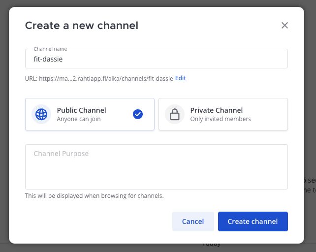
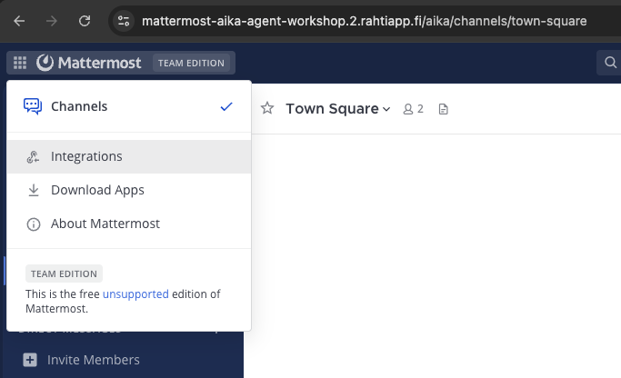
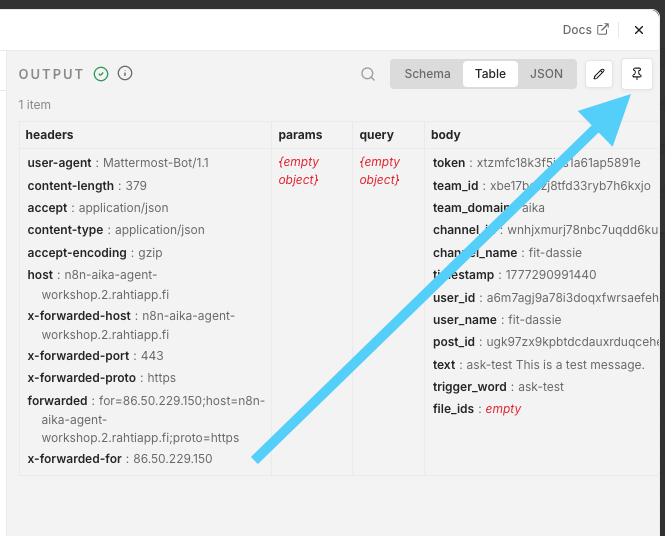
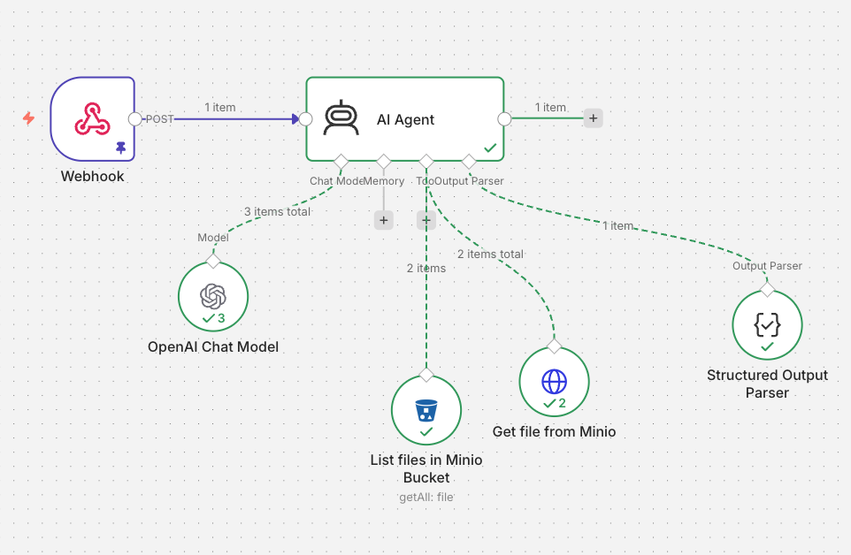

# Phase 4: Capstone

In this capstone phase, we connect n8n, Mattermost, and MinIO into one end‑to‑end workflow:

* Mattermost is the user interface (chat).
* n8n orchestrates the logic.
* MinIO acts as a simple document store (TXT files, RAG‑like).

The workflow listens to messages in a Mattermost channel, retrieves relevant TXT files from MinIO, passes them to an LLM for extraction/summarization, and posts a response back to Mattermost.


!!! warning

    This is not a full RAG implementation. We skip embeddings and similarity search. Instead, we read all TXT files from a bucket and let the LLM reason over them. This is intentional for workshop simplicity.

## Prerequisites (Already Provided)

Each attendee already has:

- ✅ A Mattermost account
- ✅ Permission to create Mattermost Integrations
- ✅ A MinIO username and password

In this documentation, we will use the example alias: `fit-dassie`. You should replace it with your own alias where applicable.

## Architecture

High‑Level Architecture

```
Mattermost (Channel Message)
        ↓
   n8n Workflow
        ↓
   MinIO (TXT files)
        ↓
   OpenAI (via proxy)
        ↓
Mattermost (Bot Reply)
```


## Step 1: Prepare MinIO Storage

### Log in to MinIO

Open the MinIO web UI. Default is: [minio-console-aika-agent-workshop.2.rahtiapp.fi](https://minio-console-aika-agent-workshop.2.rahtiapp.fi)

Log in using: 

* Username: your minio_username (e.g. `fit-dassie`)
* Password: your minio_password (e.g. `Fit-Dassie-42`)

### Create a Bucket

Create a bucket named after your alias. This can be done using the `+ Create Bucket` in Minio Console's left side navigation. Note that the buckets are shared, so do not place any sensitive information in them. The bucket name must be unique across all participants, so use your alias to ensure that.

* e.g. `fit-dassie`

!!! warning

    When you do add files to the bucket, notice that there are some naming rules that will make your life easy when referencing them in n8n:

    * lowercase (`a-z`)
    * no spaces
    * no special characters (except dash `-`)

    Thus, prefer file names like `colors.txt` or `menu.txt`.

### Upload TXT Files

Create a few simple TXT files that you will want your LLM to be able to use as reference documents. For example:

* menu.txt
* projects.txt

Let's imagine a use case where some information arrives in a non-JSON format. It can be mostly machine-readable, but not fully structured. Parsing this sort of content without LLM, using only rules and regexes, can be a nightmare. But LLMs can easily extract relevant information from such content if prompted correctly. Let's see how we can get this working.

??? info "Example content of menu.txt"

    ```
    Monday
    - Starter: Potato Soup
    - Main: Pasta
    - Dessert: Cookies

    Tuesday
    - Salad for starters
    - Mac and Cheese as main course
    - Ice Cream to finish

    Wednesday
    - 1: Cale Soup
    - 2: Reindeer Stew
    - 3: Chocolate Cake

    Thursday
    Our offering includes Grated Salad, Pea Soup, Pan Cakes and also some levain bread.

    Friday
    - Tom Yum Soup
    - Thai Curry
    - Mango Sticky Rice
    - Remember that it is a bring your kid to work day, so we have some fun snacks for the kids as well!
    ```

??? info "Example content of projects.txt"

    ```
    Active Projects as of 2026/Q1

    - Title: FIT Dassie
      Description: A project to build a simple RAG‑like workflow using n8n, Mattermost, and MinIO.
      Status: Active
    - Title: FIT Capybara
      Description: A project to explore agentic capabilities of LLMs using n8n and custom APIs.
      Status: Planning
    - Title: FIT Otter
      Description: A project to create a knowledge graph from unstructured data using n8n and Neo4j.
      Status: Completed
    ```

## Step 2: n8n Workflow

Create a new workflow in n8n and name it something like `My Capstone Workflow`. We will build the workflow step by step in the next sections. To start, we will only add the trigger, which will be a **Webhook** node that listens for incoming messages from Mattermost.

1. Add a Webhook node to the workflow.
2. Change the HTTP Method to `POST`.

Now, ==the second step this is important==. Change the HTTP Method to `POST`. Otherwise, the integration has no chance of working.

Copy the URIs to your MEMO text file, as you will need them later. They look like...

* Test URL: `https://n8n-aika-agent-workshop.2.rahtiapp.fi/webhook-test/<uuid>`
* Production URL: `https://n8n-aika-agent-workshop.2.rahtiapp.fi/webhook/<uuid>`

!!! warning

    Leave the Authentication to None and Response to "Immediately". Later on, the Mattermost Outgoing Webook will give us token, looking like `xtzmfc18k3f5ixs1a61ap5551e`, which we *could* use for validation. We won't do it in this workshop to save some time. In product, you should validate it.

!!! tip

    Geeky note. You could now test it using e.g. CURL like this, assuming you press the `Listen for test event` button in n8n first:

    ```bash
    URI='https://n8n-aika-agent-workshop.2.rahtiapp.fi/webhook-test/<uuid>'
    curl -X POST $URI -d '{"text": "Hello from CURL!"}' -H "Content-Type: application/json"
    ```

## Step 3: Create a Mattermost Integration

### Create a channel

To avoid one ultra cluttered channel, create a new channel for this bot to operate in. You can name it after your alias, e.g. `fit-dassie`.


/// caption
When creating a new channel, you can set the name to match your alias.
///

### Go to Integrations


/// caption
In Mattermost, the Integrations are in the top-left corner.
///

### Create an Outgoing Webhook

The *specific* names are not that important, but for consistency, you can use:

* Title: `fit-dassie-out-test`
* Content Type: `application/json`
* Channel: same channel as above (e.g. `fit-dassie`)
* Trigger Words: `ask-test`
* Trigger When: **First word matches a trigger word exactly**
* Callback URLs: `https://n8n-aika-agent-workshop.2.rahtiapp.fi/webhook-test/<uuid>`

!!! tip

    Why `-test`? Because n8n provides two webhook URLs: one for testing and one for production.

    We need to eventually add two Outgoing Webhooks: one for test, one for production.

!!! info

    Ok, so what is a trigger word? It is a word that, when typed as the first word in a message, will trigger the outgoing webhook. For example, if you type:

    > ask-test What is on the menu today?

    The trigger word is `ask-test`, so the outgoing webhook will include payload with the message text and other metadata. This allows n8n to know that it should process this message.

## Step 4: Test the Integration

So far, we should be able to trigger the n8n workflow by sending a message in the Mattermost channel. Try it out:

1. Go to n8n and click the `Listen for test event` button in the Webhook node.
2. In Mattermost, in your channel, type: `ask-test This is a test message`


/// caption
You should now see the message payload in n8n on the right side of the node. The right side is the output. You can press the Pin icon to make sure that the output stays the same. This will allow you to develop the pipeline without calling the webhook again and again.
///


## Step 5: Add AI Agent.

Add `AI Agent` node that is connected to the Webhook. Open the settings and change:

* Source for Prompts: `Define below`
* Prompt: `Expression` (see below)

```
You are a helpful assistant.

Answer ONLY using the information in the documents provided by the Minio S3 related tools. Try to infer what file you need based on the user query and the file names.

If the answer is not found, reply: "I could not find this information in the documents."

USER QUERY:
{{ $json.body.text }}
```

## Step 6: Add Output Parser

In the `AI Agent` Node, activate the `Require Specific Output Format`. It will guide you to add an output parser. Click the link and it will open the Add Node menu to the right. Choose `Structured Output Parser`. Choose the default Schema type as Generate From JSON Example, and add the following JSON as an example of the output you want from the LLM:

```json
{
  "answer": "This would contain the answer to the user query.",
  "source_file": "menu.txt"
}
```

## Step 7: Add MinIO Tools

We will add two Tools. Click the `+` icon in the AI Agent node, and add an **S3 Tool Node**.

### First tool: List Files in Bucket

Click the Set up Credential and fill the following content:

* You can name the tool in top-left corger to be `List Files in Minio Bucket`.
* S3 Endpoint: `http://minio:9000` (Internal!)
* Region: anything
* Access Key ID: your MinIO username (e.g. `fit-dassie`)
* Secret Access Key: your MinIO password (e.g. `Fit-Dassie-42`)
* Region: `us-east-1`
* Force Path Style: `true` (important for MinIO!)

In the Node itself, set the...

* Tool description: `List all files in the Bucket that is reserved for suitable files.`
* Resource: File
* Operation: Get Many
* Bucket Name: `fit-dassie` (or your alias)

### Second tool: Get File Content

It would be great idea to add another S3 node that would Download the file. Sadly, the data is returned as a binary in `data` field, and the AI Agent does not know how to handle it. Thus, we will use a non-optimal workaround: we will performa typical HTTP GET request to the Minio URL of the file. This will return the content assuming that the file is public. And, the whole bucket has been made public by the instructor beforehand, so it should work.

1. Create a new HTTP Request node (as a Tool).
2. Name it `Get file from Minio`.
3. Method: `GET`
4. URL: Click the magic icon and make it to be automatically defined by the model.

Add a description to the URL field:

> "The URI is in form: http://minio:9000/fit-dassie/<FILENAME>"

!!! warning

    Replace the `fit-dassie` with your own alias. The `<FILENAME>` is a placeholder that the LLM will replace with the actual file name that it wants to read.

Now, if you execute it and add a direct path to the file, it should return a JSON like this:

```
[
  {
    "data": "Active Projects as of 2026/Q1\n\n- Title: FIT Dassie\n  Description: A project to build a simple RAG‑like workflow using n8n, Mattermost, and MinIO.\n  Status: Active\n- Title: FIT Capybara\n  Description: A project to explore agentic capabilities of LLMs using n8n and custom APIs.\n  Status: Planning\n- Title: FIT Otter\n  Description: A project to create a knowledge graph from unstructured data using n8n and Neo4j.\n  Status: Completed\n\n"
  }
]
```

Great!

## Step 8: Add Model

Now would be a good time to test that a model can call the API endpoints. Remember that our current prompt is "This is a test message", so there is a good chance that model will read all files, but not find any revelant information. However, we will find that the model is able to call the API and read the content of the files. Do as before, and:

1. Add the OpenAI Chat Model node to the AI Agent Node
2. Use the same credentials as before (OpenAI Proxy)
3. Choose a suitable model. Task is simple, so the default `gpt-5-mini` should be enough.

Now, execute the workflow using the pinned Webhook output. It should call all sorts of tools. Check the log for details of what happpened.


/// caption
The Node graph looks like this at this point. Note that 1 call to List files Tool and the 2 calls to the Get file tool.
///

## Step 9: Add Response to Mattermost

Finally, we want to post the answer back to Mattermost. For that, we will add a HTTP Request node as the last node in the workflow. This has two phases:

### Create the Incoming Webhook in Mattermost

Title: `fit-dassie-in-test`
Channel: `fit-dassie` (or your alias)
Username: `fit-dassie-bot`

After the Incoming Webhook is created, copy the URL. It looks like this:

``` text
https://mattermost-aika-agent-workshop.2.rahtiapp.fi/hooks/<id>
```

### Add HTTP Request Node in n8n

1. Add a HTTP Request node to the end of the workflow, connecting to AI Agent output.
2. Set the Method to `POST`.
3. Set the URL to the Incoming Webhook URL that you just copied.

Now, enable the switch that says ==Send Body==. The Body Content Type should be `application/json`. For **Specify Body**, choose the **Using Fields Below**.

Body Parameters:

* Key: `text`
* Value: Drag the `answer` field from the AI Agent output here.

The value field should end up including expressione like `{{ $json.output.answer }}`.

Click the ==Execute step== button, and you should see the output with `data` field having value `ok`. Now, if you head back to Mattermost, you should see a new message from the bot with the answer to your query.

## Step 10: Final Testing

Now: 

1. Remember to **Unpin** the Webhook
2. Press the large ==Execute Workflow== button in the lower-middle of the screen. 

This will make the Webhook to listen for incoming HTTP requests. Now, head to Mattermost and type a message that starts with the trigger word, e.g.:

> "ask-test What can I eat on Wednesday?"

The bot, named `fit-dassie-bot`, should reply with something like:

```
fit-dassie-bot [BOT] 10:15 AM
    On Wednesday you can eat:

    * 1: Cale Soup
    * 2: Reindeer Stew
    * 3: Chocolate Cake
```

!!! warning

    Note that you need to re-activate the workflow (press ==Execute Workflow== button) every time you want to test it from Mattermost. This is because we are using the Test Webhook URL, which only listens when the workflow is active. In production, you would use the Production Webhook URL, which listens all the time. Pressing the **Publish** button would make it active at all times, but since we have not set up the production webhook, it would not work at all.

Since it it an LLM, you can also ask much more complex questions, like:

> "ask-test What seems to be the healthiest meal of the week?"

```
fit-dassie-bot [BOT] 10:17 AM
    Thursday appears to be the healthiest meal of the week. The Thursday offering 
    includes grated salad and pea soup (vegetable-based options), along with pancakes 
    and levain bread, making it the most plant-forward/vegetable-rich option among 
    the days listed.
```

## Success Check

If the bot replies, you have successfully completed the capstone project! Congratulations!

## If you are stuck

You can copy the teacher-made JSON from the code block below. However, you will need to change some things to make it work. At minimum, you should change:

**Webhook**

1. Type unique value to the `Path`

**OpenAI Chat Model**

1. Credential will most likely need to be re-selected.

**List files in Minio Bucket**

1. Create a new credential
2. Change the bucket name to your own alias

**Get file from Minio**

1. Change the URL to match your alias


??? info "Instructor Capstone JSON"

    Copy the code below to your clipboard (using the dedicated button) and paste it into an empty Workflow.

    ```json
    {
    "name": "Instructor Capstone",
    "nodes": [
        {
        "parameters": {
            "httpMethod": "POST",
            "path": "kissa",
            "options": {}
        },
        "type": "n8n-nodes-base.webhook",
        "typeVersion": 2.1,
        "position": [
            0,
            0
        ],
        "id": "0b9e4d1b-9501-4c4a-ac4f-b127594afcc9",
        "name": "Webhook",
        "webhookId": "29b2175b-a891-4e4b-b189-c0245a91e0c9"
        },
        {
        "parameters": {
            "promptType": "define",
            "text": "=You are a helpful assistant.\n\nAnswer ONLY using the information in the documents provided by the Minio S3 related tools. Try to infer what file you need based on the user query and the file names.\n\nIf the answer is not found, reply: \"I could not find this information in the documents.\"\n\nUSER QUERY:\n{{ $json.body.text }}\n",
            "hasOutputParser": true,
            "options": {}
        },
        "type": "@n8n/n8n-nodes-langchain.agent",
        "typeVersion": 3.1,
        "position": [
            288,
            0
        ],
        "id": "f09e825a-06ef-483a-a212-997252537262",
        "name": "AI Agent"
        },
        {
        "parameters": {
            "jsonSchemaExample": "{\n  \"answer\": \"This would contain the answer to the user query.\",\n  \"source_file\": \"menu.txt\"\n}"
        },
        "type": "@n8n/n8n-nodes-langchain.outputParserStructured",
        "typeVersion": 1.3,
        "position": [
            768,
            240
        ],
        "id": "10c57c65-d6ff-41aa-bef4-d5ac20bd1bbc",
        "name": "Structured Output Parser"
        },
        {
        "parameters": {
            "descriptionType": "manual",
            "toolDescription": "List all files in the Bucket that is reserved for suitable files.",
            "operation": "getAll",
            "bucketName": "helped-cattle",
            "options": {}
        },
        "type": "n8n-nodes-base.s3Tool",
        "typeVersion": 1,
        "position": [
            384,
            336
        ],
        "id": "4d2ffa2c-ae2f-4c5a-8c26-99de7f2b9f4b",
        "name": "List files in Minio Bucket",
        "credentials": {
            "s3": {
            "id": "N3XU32Ry9n1xXLUX",
            "name": "S3 account"
            }
        }
        },
        {
        "parameters": {
            "model": {
            "__rl": true,
            "mode": "list",
            "value": "gpt-5-mini"
            },
            "builtInTools": {},
            "options": {}
        },
        "type": "@n8n/n8n-nodes-langchain.lmChatOpenAi",
        "typeVersion": 1.3,
        "position": [
            144,
            208
        ],
        "id": "5e04ad23-e82f-4eaf-97a8-c61f969c0f51",
        "name": "OpenAI Chat Model",
        "credentials": {
            "openAiApi": {
            "id": "dqWPyikBx3zK7M2P",
            "name": "OpenAI account"
            }
        }
        },
        {
        "parameters": {
            "url": "={{ /*n8n-auto-generated-fromAI-override*/ $fromAI('URL', `The URI is in form: http://minio:9000/helped-cattle/<FILENAME>`, 'string') }}",
            "options": {}
        },
        "type": "n8n-nodes-base.httpRequestTool",
        "typeVersion": 4.4,
        "position": [
            528,
            304
        ],
        "id": "5e204f62-9498-4458-8543-4f7bec13f671",
        "name": "Get file from Minio"
        },
        {
        "parameters": {
            "method": "POST",
            "url": "https://mattermost-aika-agent-workshop.2.rahtiapp.fi/hooks/meqj6if5dfnkbqkcnry8eaef8w",
            "sendBody": true,
            "bodyParameters": {
            "parameters": [
                {
                "name": "text",
                "value": "={{ $json.output.answer }}"
                }
            ]
            },
            "options": {}
        },
        "type": "n8n-nodes-base.httpRequest",
        "typeVersion": 4.4,
        "position": [
            640,
            0
        ],
        "id": "8087b7a5-042e-485b-8560-9e6da928aaa1",
        "name": "Write back to Mattermost"
        }
    ],
    "pinData": {},
    "connections": {
        "Webhook": {
        "main": [
            [
            {
                "node": "AI Agent",
                "type": "main",
                "index": 0
            }
            ]
        ]
        },
        "Structured Output Parser": {
        "ai_outputParser": [
            [
            {
                "node": "AI Agent",
                "type": "ai_outputParser",
                "index": 0
            }
            ]
        ]
        },
        "List files in Minio Bucket": {
        "ai_tool": [
            [
            {
                "node": "AI Agent",
                "type": "ai_tool",
                "index": 0
            }
            ]
        ]
        },
        "OpenAI Chat Model": {
        "ai_languageModel": [
            [
            {
                "node": "AI Agent",
                "type": "ai_languageModel",
                "index": 0
            }
            ]
        ]
        },
        "Get file from Minio": {
        "ai_tool": [
            [
            {
                "node": "AI Agent",
                "type": "ai_tool",
                "index": 0
            }
            ]
        ]
        },
        "AI Agent": {
        "main": [
            [
            {
                "node": "Write back to Mattermost",
                "type": "main",
                "index": 0
            }
            ]
        ]
        }
    },
    "active": false,
    "settings": {
        "executionOrder": "v1",
        "binaryMode": "separate"
    },
    "versionId": "1c1a1996-6130-4c48-b387-38144ef50b41",
    "meta": {
        "instanceId": "e53c576b679870315a81fbcd46c7de92f0eac0d0f964a9aa3c2d1a6f430a2bce"
    },
    "id": "JjndJT9VUB2S6AE7",
    "tags": []
    }
    ```